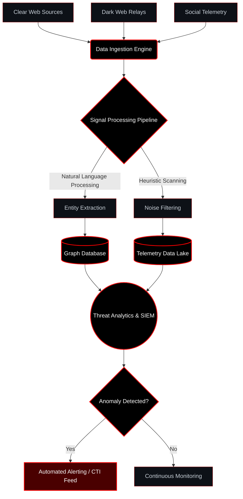

  
    
  <h1 style="color: #ff0000; margin-bottom: 0; font-family: monospace;">RYZEAN84 // INTELLIGENCE_DIRECTOR</h1>

  

  <code style="color: #ff0000;">[SYS.INIT] // GLOBAL_INTELLIGENCE_NETWORK_ONLINE</code> 
  <code style="color: #c9d1d9;">[MODULE] // OSINT_DATA_AGGREGATION_ACTIVE</code> 
  <code style="color: #c9d1d9;">[STATUS] // RESEARCH_AND_ANALYSIS_ENGAGED</code>

 

## 🔴 // CORE_DIRECTIVE

> Architecting high-fidelity intelligence pipelines and secure infrastructures to map, monitor, and mitigate emerging digital threats. Specializing in the intersection of scalable systems engineering and deep-dive data telemetry.

## 🔴 // INVESTIGATIVE_METHODOLOGIES

<table width="100%" style="background-color: #0d1117; border: 1px solid #ff0000; border-collapse: collapse;">
  <tr>
    <th width="25%" align="left" style="border: 1px solid #ff0000; padding: 10px; color: #ff0000;">Intelligence Phase</th>
    <th width="75%" align="left" style="border: 1px solid #ff0000; padding: 10px; color: #ff0000;">Operational Focus & Techniques</th>
  </tr>
  <tr>
    <td style="border: 1px solid #ff0000; padding: 10px; color: #c9d1d9;"><b>1. Digital Footprinting</b></td>
    <td style="border: 1px solid #ff0000; padding: 10px; color: #c9d1d9;">Passive domain reconnaissance, WHOIS history, DNS telemetry, and certificate transparency parsing.</td>
  </tr>
  <tr>
    <td style="border: 1px solid #ff0000; padding: 10px; color: #c9d1d9;"><b>2. SOCMINT Analysis</b></td>
    <td style="border: 1px solid #ff0000; padding: 10px; color: #c9d1d9;">Cross-platform identity mapping, sentiment tracking, and behavioral timeline correlation.</td>
  </tr>
  <tr>
    <td style="border: 1px solid #ff0000; padding: 10px; color: #c9d1d9;"><b>3. Infrastructure Mapping</b></td>
    <td style="border: 1px solid #ff0000; padding: 10px; color: #c9d1d9;">BGP routing observation, autonomous system (AS) analysis, and service-level fingerprinting.</td>
  </tr>
  <tr>
    <td style="border: 1px solid #ff0000; padding: 10px; color: #c9d1d9;"><b>4. Deep Data Telemetry</b></td>
    <td style="border: 1px solid #ff0000; padding: 10px; color: #c9d1d9;">Credential leak aggregation, threat actor profiling, and unstructured data ingestion.</td>
  </tr>
  <tr>
    <td style="border: 1px solid #ff0000; padding: 10px; color: #c9d1d9;"><b>5. Geospatial Intelligence</b></td>
    <td style="border: 1px solid #ff0000; padding: 10px; color: #c9d1d9;">EXIF metadata extraction, satellite imagery correlation, and physical security operational analysis.</td>
  </tr>
  <tr>
    <td style="border: 1px solid #ff0000; padding: 10px; color: #c9d1d9;"><b>6. Financial OSINT</b></td>
    <td style="border: 1px solid #ff0000; padding: 10px; color: #c9d1d9;">Cryptocurrency ledger tracing, transaction graph analysis, and corporate entity resolution.</td>
  </tr>
  <tr>
    <td style="border: 1px solid #ff0000; padding: 10px; color: #c9d1d9;"><b>7. Network Forensics</b></td>
    <td style="border: 1px solid #ff0000; padding: 10px; color: #c9d1d9;">Traffic pattern analysis, PCAP parsing, protocol reverse engineering, and malware behavioral analysis.</td>
  </tr>
</table>

## 🔴 // TECHNICAL_CAPABILITIES & STACK

  
<b>[ SYS.LANGUAGES // CORE_LOGIC ]</b>

  
    
  
<b>[ SYS.INFRASTRUCTURE // CLOUD_ORCHESTRATION ]</b>

  
    
  
<b>[ SYS.ANALYSIS // DATA_PROCESSING ]</b>

  

## 🔴 // ADVANCED_DATA_AGGREGATION_PIPELINE

## 🔴 // ARCHITECTURAL_DESIGN_PATTERNS

- **Zero-Trust Network Access (ZTNA):** Implementing strict identity-based access controls and micro-segmentation across distributed nodes.
- **Data Lake Telemetry Ingestion:** Designing highly available pipelines for structured and unstructured threat data processing and retention via ELK/Splunk.
- **Automated Entity Resolution:** Utilizing graph databases (Neo4j) to automatically correlate disparate data points into unified intelligence profiles.
- **Resilient Cloud Infrastructure:** Orchestrating scalable, fault-tolerant analysis environments using Kubernetes and Terraform on AWS/GCP.
- **Secure Enclaves:** Deploying isolated, ephemeral sandboxes for malware detonation and untrusted file analysis.

 

  

  <code style="color: #c9d1d9;">[EOF] // END_OF_TRANSMISSION</code>

